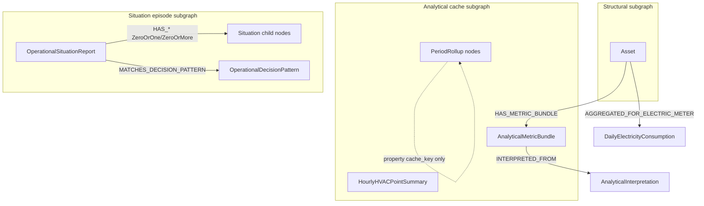
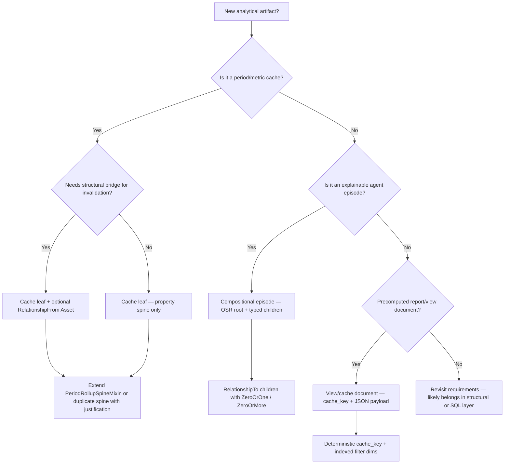

# Neomodel notes

Overview and documentation index for [Neomodel 6.0.1](https://neomodel.readthedocs.io/en/latest/) — an Object Graph Mapper (OGM) for [Neo4j](https://www.neo4j.org/), built on [neo4j-python-driver](https://github.com/neo4j/neo4j-python-driver).

Source: [Neomodel documentation (latest)](https://neomodel.readthedocs.io/en/latest/)

---

## Key capabilities (homepage bullets)

| Capability | Where to read |
|---|---|
| Familiar Django model style definitions | [Getting started — Defining Node Entities and Relationships](https://neomodel.readthedocs.io/en/getting_started.html#defining-node-entities-and-relationships), [Schema management — Defining your model](https://neomodel.readthedocs.io/en/schema_management.html#defining-your-model), [Property types](https://neomodel.readthedocs.io/en/properties.html) |
| Powerful query API | [Getting started — Querying the graph](https://neomodel.readthedocs.io/en/getting_started.html#querying-the-graph), [Filtering and ordering](https://neomodel.readthedocs.io/en/filtering_ordering.html), [Path traversal](https://neomodel.readthedocs.io/en/traversal.html), [Advanced query operations](https://neomodel.readthedocs.io/en/advanced_query_operations.html), [Sync API — Match](https://neomodel.readthedocs.io/en/module_documentation_sync.html#module-neomodel.sync_.match) |
| Enforce your schema through cardinality restrictions | [Relationships — Cardinality](https://neomodel.readthedocs.io/en/relationships.html#cardinality), [Schema management](https://neomodel.readthedocs.io/en/schema_management.html) |
| Full transaction support | [Transactions](https://neomodel.readthedocs.io/en/transactions.html) |
| Thread safe | [Extending neomodel — neomodel under multiple processes and threads](https://neomodel.readthedocs.io/en/extending.html#neomodel-under-multiple-processes-and-threads) |
| Async support | [Getting started — Async neomodel](https://neomodel.readthedocs.io/en/getting_started.html#async-neomodel), [Async API Documentation](https://neomodel.readthedocs.io/en/module_documentation_async.html) |
| pre/post save/delete hooks | [Hooks](https://neomodel.readthedocs.io/en/hooks.html), [Hooks on relationships](https://neomodel.readthedocs.io/en/hooks.html#hooks-on-relationships) |
| Django integration via django_neomodel | [django-neomodel (GitHub)](https://github.com/neo4j-contrib/django-neomodel) |

---

## Requirements

From [Requirements](https://neomodel.readthedocs.io/en/latest/#requirements):

**For releases 5.x:**

- Python 3.7+
- neo4j 5.x, 4.4 (LTS)

**For releases 4.x:**

- Python 3.7 → 3.10
- Neo4j 4.x (including 4.4 LTS for neomodel version 4.0.10)

---

## Installation

From [Installation](https://neomodel.readthedocs.io/en/latest/#installation):

**PyPI (recommended):**

```bash
pip install neomodel
```

**From GitHub:**

```bash
pip install git+git://github.com/neo4j-contrib/neomodel.git@HEAD#egg=neomodel-dev
```

---

## Attention — New in 6.0

From [Neomodel documentation — Attention](https://neomodel.readthedocs.io/en/latest/#attention):

- **SemVer:** neomodel now uses major.minor.patch versioning.
- **Modern configuration system:** dataclass with typing, runtime/update validation, environment-variable support. See [Configuration — Database Connection Setup](https://neomodel.readthedocs.io/en/configuration.html#database-connection-setup) and [Modern Configuration System (Version 6.0+)](https://neomodel.readthedocs.io/en/configuration.html#modern-configuration-system-version-6-0).
- **`merge_by` on batch operations:** customize merge behaviour (label and property keys). See [Batch node operations](https://neomodel.readthedocs.io/en/batch.html).

### Breaking changes in 6.0

- Soft cardinality check is available for all cardinalities; **strict check is enabled by default**.
- **List object resolution from Cypher** no longer returns “2-depth” lists — e.g. `RETURN collect(node)` is at `results[0][0]` instead of `results[0][0][0]`.
- **`AsyncDatabase` / `Database` are true singletons.**
- Standalone methods moved into `Database()` (removed outside the class):
  - `change_neo4j_password`
  - `clear_neo4j_database`
  - `drop_constraints`
  - `drop_indexes`
  - `remove_all_labels`
  - `install_labels`
  - `install_all_labels`
- **Async:** use the equivalents on the `AsyncDatabase()` `_adb_` singleton.

---

## Contents (documentation map)

Top-level sections in doc order, with subsection links.

### Getting started

[Getting started](https://neomodel.readthedocs.io/en/getting_started.html)

- [Connecting](https://neomodel.readthedocs.io/en/getting_started.html#connecting)
- [Querying the graph](https://neomodel.readthedocs.io/en/getting_started.html#querying-the-graph)
- [Defining Node Entities and Relationships](https://neomodel.readthedocs.io/en/getting_started.html#defining-node-entities-and-relationships)
- [Database Inspection — Requires APOC](https://neomodel.readthedocs.io/en/getting_started.html#database-inspection-requires-apoc)
- [Applying constraints and indexes](https://neomodel.readthedocs.io/en/getting_started.html#applying-constraints-and-indexes)
- [Remove existing constraints and indexes](https://neomodel.readthedocs.io/en/getting_started.html#remove-existing-constraints-and-indexes)
- [Generate class diagram](https://neomodel.readthedocs.io/en/getting_started.html#generate-class-diagram)
- [Create, Update, Delete operations](https://neomodel.readthedocs.io/en/getting_started.html#create-update-delete-operations)
- [Retrieving nodes](https://neomodel.readthedocs.io/en/getting_started.html#retrieving-nodes)
- [Relationships](https://neomodel.readthedocs.io/en/getting_started.html#relationships)
- [Retrieving additional relations](https://neomodel.readthedocs.io/en/getting_started.html#retrieving-additional-relations)
- [Async neomodel](https://neomodel.readthedocs.io/en/getting_started.html#async-neomodel)
- [Full example](https://neomodel.readthedocs.io/en/getting_started.html#full-example)

### Relationships

[Relationships](https://neomodel.readthedocs.io/en/relationships.html)

- [Cardinality](https://neomodel.readthedocs.io/en/relationships.html#cardinality)
- [Properties](https://neomodel.readthedocs.io/en/relationships.html#properties)
- [Relationship Uniqueness](https://neomodel.readthedocs.io/en/relationships.html#relationship-uniqueness)
- [Relationships and Inheritance](https://neomodel.readthedocs.io/en/relationships.html#relationships-and-inheritance)
- [Explicit Traversal](https://neomodel.readthedocs.io/en/relationships.html#explicit-traversal)

### Property types

[Property types](https://neomodel.readthedocs.io/en/properties.html)

- [Naming Convention](https://neomodel.readthedocs.io/en/properties.html#naming-convention)
- [Defaults](https://neomodel.readthedocs.io/en/properties.html#defaults)
- [Mandatory / Optional Properties](https://neomodel.readthedocs.io/en/properties.html#mandatory-optional-properties)
- [Choices](https://neomodel.readthedocs.io/en/properties.html#choices)
- [Array Properties](https://neomodel.readthedocs.io/en/properties.html#array-properties)
- [Unique Identifiers](https://neomodel.readthedocs.io/en/properties.html#unique-identifiers)
- [Dates and times](https://neomodel.readthedocs.io/en/properties.html#dates-and-times)
- [Other properties](https://neomodel.readthedocs.io/en/properties.html#other-properties)
- [Aliasing properties](https://neomodel.readthedocs.io/en/properties.html#aliasing-properties)
- [Independent database property name](https://neomodel.readthedocs.io/en/properties.html#independent-database-property-name)
- [Reserved properties](https://neomodel.readthedocs.io/en/properties.html#reserved-properties)
- [Notes](https://neomodel.readthedocs.io/en/properties.html#notes)

### Spatial Properties

[Spatial Properties](https://neomodel.readthedocs.io/en/spatial_properties.html)

- [The Point](https://neomodel.readthedocs.io/en/spatial_properties.html#the-point)
- [Points in Neo4j](https://neomodel.readthedocs.io/en/spatial_properties.html#points-in-neo4j)
- [Points in neomodel](https://neomodel.readthedocs.io/en/spatial_properties.html#points-in-neomodel)
- [NeomodelPoint in detail](https://neomodel.readthedocs.io/en/spatial_properties.html#neomodelpoint-in-detail)
- [PointProperty in detail](https://neomodel.readthedocs.io/en/spatial_properties.html#pointproperty-in-detail)
- [Examples](https://neomodel.readthedocs.io/en/spatial_properties.html#examples)

### Schema management

[Schema management](https://neomodel.readthedocs.io/en/schema_management.html)

- [Defining your model](https://neomodel.readthedocs.io/en/schema_management.html#defining-your-model)
- [Applying constraints and indexes](https://neomodel.readthedocs.io/en/schema_management.html#applying-constraints-and-indexes)

### Filtering and ordering

[Filtering and ordering](https://neomodel.readthedocs.io/en/filtering_ordering.html)

- [Filtering](https://neomodel.readthedocs.io/en/filtering_ordering.html#filtering)
- [Ordering](https://neomodel.readthedocs.io/en/filtering_ordering.html#ordering)

### Path traversal

[Path traversal](https://neomodel.readthedocs.io/en/traversal.html)

- [Traverse relations](https://neomodel.readthedocs.io/en/traversal.html#traverse-relations)
- [Traverse relations (deprecated)](https://neomodel.readthedocs.io/en/traversal.html#traverse-relations-deprecated)
- [Fetch relations (deprecated)](https://neomodel.readthedocs.io/en/traversal.html#fetch-relations-deprecated)
- [Optional match (deprecated)](https://neomodel.readthedocs.io/en/traversal.html#optional-match-deprecated)
- [Unique variables](https://neomodel.readthedocs.io/en/traversal.html#unique-variables)
- [Resolve results](https://neomodel.readthedocs.io/en/traversal.html#resolve-results)

### Advanced query operations

[Advanced query operations](https://neomodel.readthedocs.io/en/advanced_query_operations.html)

- [Annotate — Aliasing](https://neomodel.readthedocs.io/en/advanced_query_operations.html#annotate-aliasing)
- [Aggregations](https://neomodel.readthedocs.io/en/advanced_query_operations.html#aggregations)
- [Intermediate transformations](https://neomodel.readthedocs.io/en/advanced_query_operations.html#intermediate-transformations)
- [Subqueries](https://neomodel.readthedocs.io/en/advanced_query_operations.html#subqueries)
- [Helpers](https://neomodel.readthedocs.io/en/advanced_query_operations.html#helpers)

### Semantic Indexes

[Semantic Indexes](https://neomodel.readthedocs.io/en/semantic_indexes.html)

- [Full Text Index](https://neomodel.readthedocs.io/en/semantic_indexes.html#full-text-index)
- [Vector Index](https://neomodel.readthedocs.io/en/semantic_indexes.html#vector-index)

### Cypher queries

[Cypher queries](https://neomodel.readthedocs.io/en/cypher.html)

- [Stand alone](https://neomodel.readthedocs.io/en/cypher.html#stand-alone)
- [Integrations](https://neomodel.readthedocs.io/en/cypher.html#integrations)
- [Logging](https://neomodel.readthedocs.io/en/cypher.html#logging)
- [Utilities](https://neomodel.readthedocs.io/en/cypher.html#utilities)

### Transactions

[Transactions](https://neomodel.readthedocs.io/en/transactions.html)

- [Basic usage](https://neomodel.readthedocs.io/en/transactions.html#basic-usage)
- [Explicit Transactions](https://neomodel.readthedocs.io/en/transactions.html#explicit-transactions)
- [Bookmarks](https://neomodel.readthedocs.io/en/transactions.html#bookmarks)
- [Impersonation](https://neomodel.readthedocs.io/en/transactions.html#impersonation)
- [Parallel runtime](https://neomodel.readthedocs.io/en/transactions.html#parallel-runtime)

### Hooks

[Hooks](https://neomodel.readthedocs.io/en/hooks.html)

- [Hooks on relationships](https://neomodel.readthedocs.io/en/hooks.html#hooks-on-relationships)

### Batch node operations

[Batch node operations](https://neomodel.readthedocs.io/en/batch.html)

- [create()](https://neomodel.readthedocs.io/en/batch.html#create)
- [create_or_update()](https://neomodel.readthedocs.io/en/batch.html#create-or-update)
- [get_or_create()](https://neomodel.readthedocs.io/en/batch.html#get-or-create)

### Configuration

[Configuration](https://neomodel.readthedocs.io/en/configuration.html)

- [Database Connection Setup](https://neomodel.readthedocs.io/en/configuration.html#database-connection-setup)
- [Modern Configuration System (Version 6.0+)](https://neomodel.readthedocs.io/en/configuration.html#modern-configuration-system-version-6-0)
- [Legacy Configuration (Backward Compatibility)](https://neomodel.readthedocs.io/en/configuration.html#legacy-configuration-backward-compatibility)
- [Managing Connections](https://neomodel.readthedocs.io/en/configuration.html#managing-connections)
- [Security Best Practices](https://neomodel.readthedocs.io/en/configuration.html#security-best-practices)
- [Additional Configuration Options](https://neomodel.readthedocs.io/en/configuration.html#additional-configuration-options)
- [Index and Constraint Management](https://neomodel.readthedocs.io/en/configuration.html#index-and-constraint-management)

### Extending neomodel

[Extending neomodel](https://neomodel.readthedocs.io/en/extending.html)

- [Inheritance](https://neomodel.readthedocs.io/en/extending.html#inheritance)
- [Custom label](https://neomodel.readthedocs.io/en/extending.html#custom-label)
- [Optional Labels](https://neomodel.readthedocs.io/en/extending.html#optional-labels)
- [Mixins](https://neomodel.readthedocs.io/en/extending.html#mixins)
- [Overriding the StructuredNode constructor](https://neomodel.readthedocs.io/en/extending.html#overriding-the-structurednode-constructor)
- [Automatic class resolution](https://neomodel.readthedocs.io/en/extending.html#automatic-class-resolution)
- [Database specific labels](https://neomodel.readthedocs.io/en/extending.html#database-specific-labels)
- [neomodel under multiple processes and threads](https://neomodel.readthedocs.io/en/extending.html#neomodel-under-multiple-processes-and-threads)

### General API

[General API](https://neomodel.readthedocs.io/en/module_documentation.html)

- [Properties](https://neomodel.readthedocs.io/en/module_documentation.html#module-neomodel.properties)
- [Exceptions](https://neomodel.readthedocs.io/en/module_documentation.html#module-neomodel.exceptions)
- [Scripts](https://neomodel.readthedocs.io/en/module_documentation.html#module-neomodel.scripts.neomodel_inspect_database)

### Sync API Documentation

[Sync API Documentation](https://neomodel.readthedocs.io/en/module_documentation_sync.html)

- [Core](https://neomodel.readthedocs.io/en/module_documentation_sync.html#core)
- [Relationships](https://neomodel.readthedocs.io/en/module_documentation_sync.html#module-neomodel.sync_.relationship)
- [Property Manager](https://neomodel.readthedocs.io/en/module_documentation_sync.html#module-neomodel.sync_.property_manager)
- [Paths](https://neomodel.readthedocs.io/en/module_documentation_sync.html#module-neomodel.sync_.path)
- [Match](https://neomodel.readthedocs.io/en/module_documentation_sync.html#module-neomodel.sync_.match)

### Async API Documentation

[Async API Documentation](https://neomodel.readthedocs.io/en/module_documentation_async.html)

- [Core](https://neomodel.readthedocs.io/en/module_documentation_async.html#core)
- [Relationships](https://neomodel.readthedocs.io/en/module_documentation_async.html#module-neomodel.async_.relationship)
- [Property Manager](https://neomodel.readthedocs.io/en/module_documentation_async.html#module-neomodel.async_.property_manager)
- [Paths](https://neomodel.readthedocs.io/en/module_documentation_async.html#module-neomodel.async_.path)
- [Match](https://neomodel.readthedocs.io/en/module_documentation_async.html#module-neomodel.async_.match)

---

## Indices and tables

From [Indices and tables](https://neomodel.readthedocs.io/en/latest/#indices-and-tables):

- [Index](https://neomodel.readthedocs.io/en/genindex.html)
- [Module Index](https://neomodel.readthedocs.io/en/py-modindex.html)

---

## Sidebar navigation (quick links)

Same top-level pages as the doc sidebar:

- [Getting started](https://neomodel.readthedocs.io/en/getting_started.html)
- [Relationships](https://neomodel.readthedocs.io/en/relationships.html)
- [Property types](https://neomodel.readthedocs.io/en/properties.html)
- [Spatial Properties](https://neomodel.readthedocs.io/en/spatial_properties.html)
- [Schema management](https://neomodel.readthedocs.io/en/schema_management.html)
- [Filtering and ordering](https://neomodel.readthedocs.io/en/filtering_ordering.html)
- [Path traversal](https://neomodel.readthedocs.io/en/traversal.html)
- [Advanced query operations](https://neomodel.readthedocs.io/en/advanced_query_operations.html)
- [Semantic Indexes](https://neomodel.readthedocs.io/en/semantic_indexes.html)
- [Cypher queries](https://neomodel.readthedocs.io/en/cypher.html)
- [Transactions](https://neomodel.readthedocs.io/en/transactions.html)
- [Hooks](https://neomodel.readthedocs.io/en/hooks.html)
- [Batch node operations](https://neomodel.readthedocs.io/en/batch.html)
- [Configuration](https://neomodel.readthedocs.io/en/configuration.html)
- [Extending neomodel](https://neomodel.readthedocs.io/en/extending.html)
- [General API](https://neomodel.readthedocs.io/en/module_documentation.html)
- [Sync API Documentation](https://neomodel.readthedocs.io/en/module_documentation_sync.html)
- [Async API Documentation](https://neomodel.readthedocs.io/en/module_documentation_async.html)

---

# forge_odb analytical Neomodel design guide

The sections below map Neomodel 6.x capabilities to patterns used in `forge_odb/analytical`. Use them when adding or reviewing analytical NeoModel classes.

## forge_odb Neomodel stack

| Concern | forge_odb choice |
|---|---|
| Base class | `DjangoNeoModelWithCreatedAndUpdatedProps` (`forge_odb/util/django/neomodel.py`) — extends `django_neomodel.DjangoNode`, auto-manages `created` / `updated` via custom `save()` |
| DB handle | Sync singleton `neomodel.sync_.database.db` (Neomodel 6 — not raw `StructuredNode` without Django integration) |
| Label prefix | `__label__ = f'{AnalyticalODBDjangoAppConfig.label}_…'` → e.g. `ForgeODB_Analytical_HVACZoneComfortPeriodRollup` |
| Django Meta | `Meta.managed = False`, `app_label = AnalyticalODBDjangoAppConfig.label` — graph schema is owned by Neo4j, not Django migrations |
| Neomodel 6 imports | Relationship/cardinality from `neomodel.sync_.relationship_manager` / `neomodel.sync_.cardinality`; `StructuredRel` from `neomodel.sync_.relationship` |
| Connection | `GraphDbConfig.connect_db()` → `db.set_connection()` then `db.install_all_labels()` (always on; imports structural + analytical models first) |
| File-backed Cypher | [`forge_odb/analytical/_graph_db/`](../../forge_odb/analytical/_graph_db/) — `.cypher` templates + `bind_label()`; executed via [`_neo4j_bulk.py`](../../forge_odb/analytical/_neo4j_bulk.py) facade |
| Index install script | `bin/neo4j/install-labels-and-indexes [--editable] <FACILITY_NAME>` — imports structural + analytical model modules before install |
| Lazy model import | `forge_odb/analytical/_django/__init__.py` uses PEP 562 `__getattr__` so Django app registry is ready before model classes load |

Three analytical subgraphs coexist in one Neo4j database:



---

## Model design decision tree

When adding a new analytical NeoModel, pick one primary pattern:



| Pattern | When to use | Canonical examples |
|---|---|---|
| **Cache leaf (rollup/bundle)** | Precomputed aggregates keyed by facility + scope + period + algorithm version | `HVACZoneComfortPeriodRollup`, `AnalyticalMetricBundle` |
| **Compositional episode** | Auditable agent story with many typed child payloads | `OperationalSituationReport` + `SituationObservedMetric`, … |
| **View/cache document** | Question-shaped or report-shaped cached answer | `CachedHVACAnalyticalReport`, `CachedQuestionView` |
| **Legacy bridge rollup** | Deprecated; meter-linked daily/monthly consumption | `DailyElectricityConsumption` → use period rollups for new work |

---

## High-value Neomodel tips (doc-sourced, forge_odb-grounded)

Organized as **Do / Avoid / When** with links to Neomodel 6.x docs.

### Aggressive read-path indexing (`DjangoNeoModel` / analytical cache)

**Policy:** index every property that appears in a hot-path lookup — Neo4j index seek + `get_or_none(cache_key=…)` should be the default; full label scans are a bug.

| Tier | Properties | Neomodel flags | Read pattern |
| --- | --- | --- | --- |
| **T0 — identity** | `cache_key`, `consumption_external_key`, `situation_external_key` | `primary_key=True`, `unique_index=True` | One row per artifact; always `objects.get_or_none(cache_key=…)` |
| **T1 — spine window** | `facility_name`, `granularity`, `local_period_start`, `local_period_end`, `algorithm_version` | `index=True` on each | Cypher range scans (`>=` / `<` on `local_period_start`), populate invalidation, `preload_meter_rollups_bulk_index` |
| **T2 — scope / subject** | `meter_asset_name`, `zone_asset_name`, `asset_name`, `building_scope`, `metric_set_id`, `subject_kind`, `subject_key`, `bundle_cache_key` | `index=True` on each | ORM `.filter(facility_name=…, metric_set_id=…)` or indexed Cypher `WHERE` (see `_neo4j_bulk.spine_window_where_clauses`) |
| **T3 — view / episode dims** | `pattern_id`, `scope_token`, `period_token`, `replay_phase`, `agent_id`, `sort_index` | `index=True` where listed in admin or batch jobs | L3 view warm-up, situation timelines |
| **Do not index** | `metrics`, `payload`, `provenance_json`, `built_from_metric_sets`, float aggregates, `fault_*` strings used only after fetch | leave default `index=False` | Payload fields; indexing bloats write cost without helping point reads |
| **Do not index** | `created`, `updated` on `DjangoNeoModelWithCreatedAndUpdatedProps` | intentionally `index=False` | Audit timestamps only; never filter hot paths on these |

**Implementation checklist (speed-first):**

1. Extend `PeriodRollupSpineMixin` (or duplicate spine with justification) — never add a filter dimension without `index=True`.
2. Align Cypher with indexes: every `WHERE` clause should use indexed properties only (helpers in `forge_odb/analytical/_neo4j_bulk.py`).
3. Prefer **batch** indexed reads over N× `get_or_none`: `fetch_analytical_metric_bundles_by_cache_keys_cypher`, `preload_meter_rollups_bulk_index`, chunked `IN $keys` deletes.
4. After any new/changed `index=True`, run `connect_db()` or `bin/neo4j/install-labels-and-indexes <facility>` so constraints exist before populate/CI.
5. Re-read paths with `nodes.filter(**wide)` — replace with indexed Cypher returning keys only, then delete or hydrate in chunks.

**Compound filters:** Neo4j picks one index per predicate; still index **each** conjunct (`facility_name` AND `granularity` AND `local_period_start` range). Order `WHERE` clauses with the most selective equality first in hand-written Cypher.

### Indexing and schema

| | Guidance |
|---|---|
| **Do** | Apply the **aggressive read-path indexing** tiers above on every new `DjangoNeoModelWithCreatedAndUpdatedProps` subclass. |
| **Do** | Set `index=True` on every property used in `.filter()`, `.get_or_none()`, or Cypher `WHERE`. Set `unique_index=True` on natural keys (`cache_key`, `consumption_external_key`, `pattern_code`). |
| **Do** | Run `db.install_all_labels()` (via `connect_db()` or `bin/neo4j/install-labels-and-indexes`) after adding or changing indexed properties. |
| **Avoid** | Assuming Django migrations create Neo4j indexes — analytical models use `Meta.managed = False`. |
| **Avoid** | Indexing JSON blobs or numeric aggregates “just in case” — adds write amplification on MERGE-heavy populate. |
| **When** | Adding a new filter dimension (e.g. `metric_set_id`, `subject_kind`) — index it before shipping. See [Schema management](https://neomodel.readthedocs.io/en/latest/schema_management.html) and [Index and Constraint Management](https://neomodel.readthedocs.io/en/latest/configuration.html#index-and-constraint-management). |

### Graph schema evolution, migrations, and obsolete properties

Neo4j is **not** relational Django migrations. With **(Django-)NeoModel**, treat the Python model classes as the **application contract**; the graph is **schema-flexible** for labels and properties.

#### Neo4j “migrations” vs SQL (Django/Flyway)

| Concern | Relational DB (Django migrations) | Neo4j + (Django-)NeoModel |
| --- | --- | --- |
| **Tables / labels** | DDL migrations required | Labels appear when nodes are created; no formal DDL |
| **Columns / properties** | `ALTER TABLE` tracked in migration history | Properties are optional key–value pairs on nodes; no automatic sync with Python |
| **Indexes & constraints** | Migration files | `db.install_all_labels()` / `bin/neo4j/install-labels-and-indexes` — sync **declared** indexes from model classes |
| **Data backfills / relabel / rewire** | Often in migrations | Ad hoc **Cypher scripts** (optionally numbered), run operationally — not auto-applied on deploy |
| **Version tracking** | `django_migrations` table (or Flyway history) | **No built-in history** unless you add a runner + `SchemaMigration` nodes yourself |

Ecosystem tools exist ([Neo4j Migrations](https://neo4j.com/docs/migrations/), Liquibase/Flyway adapters), but they are **not** part of the Neomodel/django-neomodel stack and are **not** used in forge_odb today.

**forge_odb practice today:**

- **Schema-ish:** `bin/neo4j/install-labels-and-indexes` → `db.install_all_labels()` after model/index changes.
- **Graph shape / data refactors:** optional numbered `.cypher` under `_graph_migrations/` (manual, draft-or-runbook — not CI-gated like Django migrations).
- **Django `migrations/`** in this monorepo applies to **Postgres/Django relational** apps (e.g. IoT Django history), **not** the Neo4j analytical graph.

#### Policy: migrations are generally not worth maintaining

**Conclusion for (Django-)NeoModel projects:** a standing **versioned migration pipeline for the Neo4j graph is usually not worth the maintenance cost**.

Reasons:

1. **Neomodel already owns what matters for correctness at scale** — indexes and constraints declared on model classes, installed via `install_all_labels`.
2. **Property and label changes are code-first** — deploy new Python; new writes follow the new shape; old nodes can coexist.
3. **Analytical products use retire-not-mutate** — historical instances are **supposed** to remain on the graph with their snapshot fields; “migrate every node to the latest shape” fights the audit model.
4. **Migration runners add ops burden** — ordering, idempotency, multi-facility rollout, and drift between “migration head” and “code head” without the tight enforcement Django gives you on Postgres.

**Do instead:**

- Change NeoModel classes → run **install-labels-and-indexes** per facility.
- Rely on **ensure-on-read / recompute** to mint new official instances with the new payload shape.
- Use **one-off Cypher** only for rare, high-value cleanups (admin purge, relabel campaigns) — not for every property rename.

**When a numbered graph migration *is* justified:** one-time breaking graph surgery (relationship type renames, mass relabel, dedupe) where recompute cannot fix the graph and the operation is documented with dry-run counts. Keep these **exceptional**, not routine.

#### Obsolete properties on nodes (“deadweight fields”)

Removing a `Property` from a NeoModel class **does not remove** that property from existing Neo4j nodes. Old rows may still carry dropped fields (e.g. retired `source_sample_count` on analytical instances).

**This is not a crime** — especially with retire-not-mutate and audit retention.

| Area | Impact of unused properties |
| --- | --- |
| **Correctness** | None, if application code no longer reads or filters on them |
| **Indexed lookups** | None, if the dead property is **not** indexed |
| **Storage / backup** | Small per-node overhead (key + value) |
| **Query performance** | **Minimal** for targeted reads (`MATCH … WHERE n.cache_key = $key RETURN n.kwh`) — unused properties are not used in planning |
| **Full-node reads** | Slightly more I/O if you `RETURN n` or hydrate entire nodes instead of projecting fields |
| **Developer confusion** | Main risk — document contract in Python, not by assuming the graph matches the latest class exactly |

**When cleanup is optional housekeeping:** large JSON blobs removed from the contract, indexed properties no longer used (wasted index maintenance), or export/backup size matters. Example cleanup (per label, after dry-run `count`):

```cypher
MATCH (n:`ForgeODB_Analytical_ExampleMetricSet`)
REMOVE n.obsolete_property
```

**When to leave dead properties alone:** retired/historical nodes, short-lived numeric spine fields, or any case where recompute/retirement will naturally supersede old instances.

### Datetime property selection

Neomodel offers three datetime property types ([Property types — Dates and times](https://neomodel.readthedocs.io/en/latest/properties.html#dates-and-times)). **forge_odb policy:**

| Property | Stored in Neo4j | Use for | Do not use for |
| --- | --- | --- | --- |
| **`DateTimeProperty`** | UTC epoch **float** | Non-user-facing / system audit timestamps: `created`, `updated`, `computed_at`, `needs_redo_since`, `retired_at` | Period boundaries, operator-facing local civil time, indexed range scans |
| **`DateTimeNeo4jFormatProperty`** | Native Neo4j **temporal** (`neo4j.time.DateTime`) | **Facility-local, user-facing** datetimes that operators reason about and that appear in hot-path filters: `local_period_start`, `local_period_end`, `hour_start` | Ad-hoc string formatting; audit-only stamps |
| **`DateTimeFormatProperty`** | **String** (`strftime`) | **Do not use** unless a human administrator explicitly instructs so **and** provides a convincing rationale (e.g. immovable legacy external format) | New analytical or structural models — string dates break native temporal indexing/range semantics and lose timezone discipline |

**Rationale (concise):**

- **`DateTimeNeo4jFormatProperty`** gives native temporal performance (indexed `>=` / `<` on period spines, spine-window preloads) and round-trips through Bolt as a real datetime — not an opaque epoch float or a lexicographic string.
- **`DateTimeProperty`** is fine for machine audit fields that are never spine-filtered; `DjangoNeoModelWithCreatedAndUpdatedProps` uses it for `created` / `updated` (intentionally **not** indexed).
- **`DateTimeFormatProperty`** is the weakest choice: no native temporal type, easy to get comparison/timezone wrong, and no benefit over native temporal when the value is domain time the operator sees.

**Codebase consistency:** As of migration to unified analytical products, forge_odb follows this split — e.g. `meter_level.py` uses `DateTimeNeo4jFormatProperty` on `local_period_start` / `local_period_end` and `DateTimeProperty` on `computed_at` / `needs_redo_since` / `retired_at`. **`DateTimeFormatProperty` does not appear in `forge_odb`.**

**Implementation helpers (facility-local → persist):**

- **Facility-local → UTC for domain semantics:** `agent_neo.util.datetime.coerce_to_utc_for_neo4j_datetime()` — normalizes to facility-local civil time, then `astimezone(UTC)`. Used when the stored instant should be UTC but the input may be mixed (e.g. hourly consumption `hour_start`). UTC `tzinfo` is driver-safe without extra coercion.
- **ZoneInfo → driver-safe tzinfo (crash workaround):** `agent_neo.util.django_neomodel.models.coerce_to_fixed_offset_for_neo4j()` — see **Neo4j driver, zoneinfo, and pytz** below. Applied automatically on `DateTimeNeo4jFormatProperty.deflate` via `apply_neo4j_datetime_coercion_patch()` (called from `forge_odb.util.django.setup.ensure_django_setup()`).
- With `NEOMODEL_FORCE_TIMEZONE=True` in `forge_odb._django.settings`, **`DateTimeProperty` requires timezone-aware datetimes** on deflate — naive datetimes fail.

**Bulk Cypher caveat:** `UNWIND $rows` MERGE paths bypass NeoModel property `deflate`. Row dicts must carry driver-safe datetime values — call `coerce_to_fixed_offset_for_neo4j()` before `Neo4jDateTime.from_native()` (see IoT `bulk_upsert`, `computed_product_cascade._to_neo4j_datetime`). Epoch audit fields in bulk templates use UTC epoch seconds to stay comparable with `DateTimeProperty` storage.

---

## Neo4j driver, zoneinfo, and pytz (load-bearing workaround)

**Last verified:** Python **3.14.4**, neo4j driver **6.2.0** (system `python3` and Dana-ODB `.venv`). Regression tests: `Django-NeoModel/tests/agent_neo/test_neo4j_zoneinfo_driver_compat.py`.

### Problem summary

Modern Python/Django code uses **`zoneinfo.ZoneInfo`** (PEP 615) for facility IANA zones (`Asia/Kolkata`, etc.). The **neo4j Python driver** ships custom nanosecond-precision types in `neo4j.time` (not subclasses of `datetime.datetime`). Official driver docs state temporal types are designed for **`pytz` only**; `zoneinfo` and `datetime.timezone` are documented as unsupported.

When the driver converts a Python `datetime` with `ZoneInfo` via `Neo4jDateTime.from_native()`, internal paths call `tzinfo.utcoffset(neo4j_datetime)` — passing a **neo4j** `DateTime`, not a Python `datetime`. CPython's **`_zoneinfo` C extension** then reads `datetime`-only fields (e.g. `fold`) on the wrong object type, yielding **SIGSEGV** (exit -11) or garbage offsets. On neo4j 5.x the same path often raised `ValueError` instead of segfaulting.

**Symptoms we hit (Dana-ODB, 2026-07):** IoT `bulk_upsert`, HVAC `.save()`, and analytical cascade Cypher failed or crashed when persisting facility-local `ZoneInfo` datetimes to `DateTimeNeo4jFormatProperty` fields or bulk row dicts.

### pytz vs zoneinfo (why we do not just switch)

| | **zoneinfo** (our app layer) | **pytz** (driver's design center) |
|---|---|---|
| Status | Stdlib since 3.9; Django 5+ default | Third-party, maintenance mode |
| Attach tz | `datetime(..., tzinfo=ZoneInfo("…"))` | Named zones: `pytz.timezone("…").localize(naive)` |
| Duck typing | Strict — C `zoneinfo` assumes real `datetime` | Looser — often works with neo4j duck-types |
| Neo4j `from_native` + named zone | **Unsafe** until CPython/driver fix | **Supported** per driver docs |

We keep **`zoneinfo` in application code** and coerce only at the **Neo4j persistence boundary**.

### Relevant GitHub issues and docs

**neo4j/neo4j-python-driver**

| Link | Notes |
|---|---|
| [Issue #1103](https://github.com/neo4j/neo4j-python-driver/issues/1103) — `DateTime.now()` doesn't accept `datetime.UTC` tzinfo | Maintainer **@robsdedude**: driver designed for **pytz**; **`zoneinfo` can segfault** with `neo4j.time`; recommends pytz. Closed with guidance, not a zoneinfo fix. |
| [PR #1104](https://github.com/neo4j/neo4j-python-driver/pull/1104) — temporal tzinfo improvements | Docs clarified **pytz-only**; minor `DateTime.now` tweaks — other tzinfo still not fully supported. |
| [PR #914](https://github.com/neo4j/neo4j-python-driver/pull/914) — `datetime.timezone` serialization | Fixed-offset **serialization only** (pandas 2); not `zoneinfo`; server returns still use pytz. |
| [PR #625](https://github.com/neo4j/neo4j-python-driver/pull/625) — dehydrate native datetimes with zoneinfo | Sending **native** `datetime` with `zoneinfo` to Bolt — does **not** make `neo4j.time.DateTime` + `zoneinfo` safe internally. |
| [Issue #1318](https://github.com/neo4j/neo4j-python-driver/issues/1318) — transition away from pytz | Open feature request (2026-07-04); no maintainer commitment yet. |
| [Driver docs — temporal types](https://neo4j.com/docs/api/python-driver/current/types/temporal.html) | Warning: other `tzinfo` implementations "not supported and unlikely to work well". |

**python/cpython (root crash)**

| Link | Notes |
|---|---|
| [Issue #125318](https://github.com/python/cpython/issues/125318) — Segfault from `zoneinfo` with custom DateTime class | Filed by Neo4j driver maintainer; repro uses duck-typed datetime like `neo4j.time.DateTime`. **Still open** on 3.14.4. |
| [PR #139132](https://github.com/python/cpython/pull/139132) | Proposed fix (dispatch to Python attribute lookups for non-`datetime`); not in our Python build yet. |

**When to re-check:** If `test_neo4j_zoneinfo_driver_compat.py` subprocess probes start exiting 0 without coercion, revisit removing the patch.

### Our workaround (agent_neo)

**Single primitive** — `coerce_to_fixed_offset_for_neo4j(value)` in `agent_neo.util.django_neomodel.models`:

1. Pre-compute offset from the **Python** `datetime` (safe with `ZoneInfo`).
2. If the tzinfo has a zone name (`ZoneInfo.key` or `pytz.zone`), replace tzinfo with `_ZoneNamePreservingTzInfo` — fixed offset + `.key` so Bolt still sends named-zone ZonedDateTime (`b"i"`), without calling `_zoneinfo` on neo4j types.
3. If no zone name, use `datetime.timezone(offset)` (offset-only in Neo4j).

**Three enforcement points** (minimal set — bulk paths bypass NeoModel `deflate`):

| Layer | Mechanism | Location |
|---|---|---|
| ORM `.save()` / property deflate | `apply_neo4j_datetime_coercion_patch()` patches `DateTimeNeo4jFormatProperty.deflate` | `forge_odb.util.django.setup.ensure_django_setup()` |
| IoT bulk `UNWIND` rows | explicit `coerce_to_fixed_offset_for_neo4j` before `Neo4jDateTime.from_native` | `forge_odb/iot/_django/models.py` `bulk_upsert` |
| Cascade / bulk Cypher SET | `_to_neo4j_datetime()` wraps same coercion | `analytical_product/computed_product_cascade.py` |

**Not the same helper:** `coerce_to_utc_for_neo4j_datetime()` is for **domain semantics** (facility-local wall clock → UTC instant), not the zoneinfo crash. UTC datetimes do not need `_ZoneNamePreservingTzInfo`.

### Simplicity assessment (2026-07)

The workaround is **not spaghetti** — it is a thin boundary adapter:

- One coercion function + one small `tzinfo` wrapper with a documented reason.
- One global ORM monkey-patch (unavoidable without forking neomodel/driver).
- **Two** explicit call sites where Cypher bypasses properties (necessary; not scattered).

**Possible minor DRY:** a shared `to_neo4j_datetime(dt) -> Neo4jDateTime` wrapping `from_native(coerce(...))` for bulk writers — cosmetic only.

**Rejected alternatives:** (1) pytz everywhere in app code — fights Django/modern stack; (2) plain `datetime.timezone(offset)` only — simpler but drops named zone in Neo4j; (3) waiting for driver 6.x alone — **6.2.0 still segfaults**; fix is upstream in CPython #125318.

### Cardinality (Neomodel 6 strict default)

| | Guidance |
|---|---|
| **Do** | Pick `ZeroOrOne` vs `ZeroOrMore` deliberately on episode children — e.g. one `recommendation`, many `observed_metrics`. |
| **Do** | Declare cardinality on both endpoints when relationships are bidirectional (legacy meter rollups use `One` on `DailyElectricityConsumption.meter`). |
| **Avoid** | Relying on soft cardinality in production — Neomodel 6 enables **strict** checks by default; `.connect()` raises on violation. |
| **When** | Writing tests or episode persistence code that connects children — exercise connect/disconnect under strict mode. See [Relationships — Cardinality](https://neomodel.readthedocs.io/en/latest/relationships.html#cardinality). |

### Relationships and edge metadata

| | Guidance |
|---|---|
| **Do** | Use `StructuredRel` when the edge carries semantics — e.g. `DecisionPatternMatchRel` (`is_primary_match`, `match_rank`, `instance_rationale`). |
| **Do** | Choose `RelationshipFrom` vs `RelationshipTo` based on **invalidation and query direction** — bundles use `RelationshipFrom(Asset, 'HAS_METRIC_BUNDLE')` so Asset → bundle scans are natural. |
| **Avoid** | Creating duplicate parallel edges between the same node pair — Neomodel uses `MERGE` for uniqueness, but batch `create_or_update(..., relationship=…)` can leave old edges. |
| **When** | Pattern library links or audit metadata belong on the edge, not duplicated on both nodes. See [Relationships — Properties](https://neomodel.readthedocs.io/en/latest/relationships.html#properties). |

### Property-first cache vs graph aggregation

| | Guidance |
|---|---|
| **Do** | Use a deterministic `cache_key` (primary key + `unique_index`) for rollup identity — no graph edges required between rollup tiers. |
| **Do** | Store flexible L1 metrics in `JSONProperty` with optional `metrics_schema_hash` for contract drift detection (`AnalyticalMetricBundle`). |
| **Avoid** | Modeling every cross-metric dependency as graph edges — rollups aggregate in Python from child cache nodes or hourly summaries. |
| **Avoid** | Using multi-hop traversal for period aggregation when a property lookup suffices. |
| **When** | Get-or-compute orchestration in `analytical_odb.py` — `Model.objects.get_or_none(cache_key=…)` then compute + `.save()`. |

### cache_key recipe

Standard spine (via `PeriodRollupSpineMixin`):

- `facility_name` + scope dimensions + `granularity` + `local_period_start` / `local_period_end` + `algorithm_version`
- Bump `algorithm_version` to invalidate all nodes for that algorithm without deleting the graph
- Hourly summaries (`HourlyHVACPointSummary`) duplicate spine fields inline — prefer mixin for new period rollups

Helper functions live in `forge_odb/analytical/_django/models/_base/cache_keys.py`.

### merge_by / get_or_create / create_or_update

| | Guidance |
|---|---|
| **Do** | Use `get_or_create` / `create_or_update` for idempotent **single-node** upserts in structural layer. |
| **Do** | Pass explicit `merge_by={'keys': ['cache_key']}` when merge keys differ from all `required` properties (Neomodel 6). |
| **Avoid** | Using `UniqueIdProperty()` as an implicit merge key — omitted uid generates a **new** node each call. |
| **Avoid** | Batch relationship wiring via repeated `.connect()` — O(N) round-trips; use Cypher UNWIND for bulk nodes + relationships. |
| **When** | Structural schema bulk loads — see [Batch node operations](https://neomodel.readthedocs.io/en/latest/batch.html). Analytical get-or-compute typically uses explicit `cache_key` lookup + `.save()`. |

### Cypher vs ORM

| | Guidance |
|---|---|
| **Do** | Use NeoModel for single-entity point reads: `Model.objects.get_or_none(cache_key=…)`, `.filter(facility_name=…, metric_set_id=…)`. |
| **Do** | Use file-backed Cypher (see below) or `_neo4j_bulk` helpers for bundle invalidation, spine-window scans, and `UNWIND` MERGE writes. |
| **Avoid** | Mixing ORM relationship walks with large fan-out in request paths without prefetch. |
| **When** | Follow the DB implementation rule in [`structural/_django/queries.py`](../../forge_odb/structural/_django/queries.py) and [`structural/schema/_django/queries.py`](../../forge_odb/structural/schema/_django/queries.py): single entity → NeoModel; bulk → Cypher. See [Cypher queries](https://neomodel.readthedocs.io/en/latest/cypher.html). |

### Direct Cypher (`_graph_db`) vs inline `db.cypher_query`

Use the same pattern as structural [`forge_odb/structural/_graph_db/`](../../forge_odb/structural/_graph_db/) and [`forge_odb/structural/schema/_graph_db/`](../../forge_odb/structural/schema/_graph_db/): queries in `.cypher` files, loaded with `load_query()` / `load_query_text()` from [`forge_odb/util/graph_db.py`](../../forge_odb/util/graph_db.py), executed through [`forge_odb/analytical/_graph_db/_execute.py`](../../forge_odb/analytical/_graph_db/_execute.py) (`cypher_read` / `cypher_write` with `retry_neo4j_cluster_operation` on writes).

| When | Use | Example |
| --- | --- | --- |
| Single cache hit by PK | NeoModel `get_or_none(cache_key=…)` | Rollup get-or-compute |
| Bulk invalidation, range scan, `UNWIND` MERGE | `_graph_db` constants + `_neo4j_bulk` | [`bundles/delete-nodes-by-property-in-keys.cypher`](../../forge_odb/analytical/_graph_db/bundles/delete-nodes-by-property-in-keys.cypher), [`period_rollups/merge-rows-by-cache-key.cypher`](../../forge_odb/analytical/_graph_db/period_rollups/merge-rows-by-cache-key.cypher) |
| JSON-safe dicts before `JSONProperty` save | [`_json_safe.json_safe_structure`](../../forge_odb/analytical/_json_safe.py) | `CachedQuestionView.payload`, compose/L3 builders, energy rollups using `__properties__` |
| Same query in 2+ call sites | Add a `.cypher` file | Structural [`UPSERT_ASSETS`](../../forge_odb/structural/_graph_db/1-upsert-assets.cypher) |
| One-off debug / prototype | Inline `db.cypher_query` | Promote to `_graph_db` when the pattern stabilizes |

**Decision rule:** NeoModel for one node per round-trip; `_graph_db` when the query is reused, chunked (`IN $keys` / `UNWIND $rows`), or a multi-row write. Do **not** add `.cypher` files for one-liners with no reuse — that hurts maintainability without speed gain.

**Analytical labels:** period rollup NeoModel classes each have their own `__label__`. Shared templates use a `__LABEL__` placeholder; substitute with `bind_label(query, Model.__label__)` — never pass user input as the label.

**Call site convention:** mixins import helpers from `_neo4j_bulk` (facade). New bulk paths should add a `.cypher` file under `_graph_db/` first, then a thin wrapper in `_neo4j_bulk.py` if needed.

### Filtering and ordering

| | Guidance |
|---|---|
| **Do** | Index every dimension you filter on — e.g. `facility_name`, `granularity`, `local_period_start`, `metric_set_id`, `subject_kind`, `subject_key`. |
| **Do** | Use `Meta.ordering` on analytical models for stable admin/list ordering. |
| **When** | List endpoints or admin changelists filter by compound keys. See [Filtering and ordering](https://neomodel.readthedocs.io/en/latest/filtering_ordering.html). |

### Prefetch (N+1 avoidance)

| | Guidance |
|---|---|
| **Do** | Use `run_prefetch` from `forge_odb/util/django/neomodel.py` for admin/DRF list views that need relationship-heavy children. |
| **Avoid** | Iterating situation roots and lazily loading each child relationship in Python loops. |
| **When** | Structural schema admin already uses this pattern — mirror it if analytical situation admin expands. |

#### Analytical cache nodes (populate / get-or-compute)

See also [`db-N+1-problem.md`](./db-N+1-problem.md) and structural batch Cypher in `forge_odb/structural/_django/queries.py` (comments reference the same rule).

**Problem:** Nested loops that call `Model.objects.get_or_none(cache_key=…)` or `_get_first_rollup_by_cache_key` inside `for asset` × `for period` × `for point` × `for hour` cause one Neo4j round-trip per iteration. On warm populate this is pure overhead (often hundreds of queries per asset-day).

**Three approved patterns** (collect keys → bulk fetch → dict lookup):

| Pattern | When to use | Implementation |
|---|---|---|
| **`cache_key IN $keys`** (chunked) | Fixed, known key set (e.g. all hours for one asset-day) | `fetch_analytical_metric_bundles_by_cache_keys_cypher`, `fetch_period_rollup_rows_by_cache_keys_cypher`, `fetch_hvac_hourly_summaries_by_cache_keys_cypher` in `forge_odb/analytical/_neo4j_bulk.py` |
| **Spine-window preload** | Many nodes for one facility + time range (populate day) | `preload_meter_rollups_by_spine_window_cypher`, `preload_hvac_hourly_summaries_by_asset_window_cypher`, `fetch_period_rollup_cache_keys_by_spine_window_cypher` |
| **Instance-scoped bulk index** | Reuse same window across many inner loops in one populate day | `preload_meter_rollups_bulk_index` → `_meter_rollups_bulk_index_{granularity}`; HVAC period index via `PeriodCacheMixin` |

**Anti-patterns:**

- `get_or_none(cache_key=…)` inside nested loops over periods, meters, points, or hours.
- Using `get_or_none` only to test existence — use spine key set or `IN $keys` fetch instead.
- Per-meter `get_or_compute_*` in populate without a prior spine preload for that granularity/day.

**File map:**

| Area | Files |
|---|---|
| Cypher templates | `forge_odb/analytical/_graph_db/` (`bundles/`, `period_rollups/`, `hvac/`) |
| Python facade | `forge_odb/analytical/_neo4j_bulk.py` |
| Cache mixin | `forge_odb/analytical/_period_cache_mixin.py` |
| Energy bulk index | `forge_odb/analytical/_energy_period_rollup_mixin.py` (`preload_meter_rollups_bulk_index`) |
| Metric bundles (already batched) | `forge_odb/analytical/_metric_bundle_mixin.py` (`_load_metric_bundles_for_windows`) |
| HVAC orchestration | `forge_odb/analytical/analytical_odb.py` |
| Populate | `forge_odb/analytical/_populate.py` |

**Single-key reads** (`get_or_none` once per API call) remain fine for admin and point lookups; not for populate inner loops.

### Lazy model imports and label install

| | Guidance |
|---|---|
| **Do** | Export new model classes from `forge_odb/analytical/_django/models/__init__.py`. |
| **Do** | Ensure `bin/neo4j/install-labels-and-indexes` imports your module (it imports `forge_odb.analytical._django.models` wholesale). |
| **Avoid** | Eager model imports in `forge_odb/analytical/_django/__init__.py` — triggers `AppRegistryNotReady`. |
| **When** | Adding any new `StructuredNode` subclass — run index install before relying on indexed lookups in dev/CI. |

### Neomodel 6 breaking changes (relevant to forge_odb)

| Change | Impact |
|---|---|
| Strict cardinality default | Episode `.connect()` must respect `ZeroOrOne` / `ZeroOrMore`; test under strict mode |
| `db` singleton | All code uses `from neomodel.sync_.database import db`; label install via `db.install_all_labels()` |
| Cypher list depth fix | Raw `db.cypher_query` result indexing is one level shallower — adjust parsers if upgrading from Neomodel 5 |
| `merge_by` parameter | Explicit merge keys for batch upserts when natural key ≠ all required fields |

See [Attention — New in 6.0](https://neomodel.readthedocs.io/en/latest/#attention).

### Identity systems (do not conflate)

| System | Used by | Key field |
|---|---|---|
| Period cache spine | Rollups, bundles, hourly summaries, cached reports | `cache_key` (deterministic string, often primary key) |
| Situation episode | `OperationalSituationReport` | `uuid` (`UniqueIdProperty`) + optional `situation_external_key` |
| Legacy consumption | `DailyElectricityConsumption` | `consumption_external_key` + `RelationshipTo` Asset |

Pick one identity strategy per model type — do not mix `UniqueIdProperty` auto-merge with deterministic cache keys on the same logical artifact.

---

## Criss-cross relationship guidelines

Rules for linking analytical ↔ structural ↔ situation subgraphs without query blow-up.

### Principles

1. **Limit cross-subgraph edges to operational needs** — invalidation, audit trail, canvas anchor, meter identity bridge.
2. **Prefer deterministic property keys over traversals** for cache hits (`cache_key` lookup beats `MATCH` chains between rollups).
3. **Property-first rollups do not link to each other** — higher-period rollups read lower-period nodes via orchestration code, not graph edges.
4. **Episode star graph stays internal** — situation children hang off `OperationalSituationReport`; cross-link to structural Asset only when UI or invalidation requires it.

### Allowed cross-subgraph edge types

| Relationship | From | To | Purpose |
|---|---|---|---|
| `HAS_METRIC_BUNDLE` | `Asset` | `AnalyticalMetricBundle` | Bundle invalidation / subject anchor |
| `AGGREGATED_FOR_ELECTRIC_METER` | `DailyElectricityConsumption` | `Asset` | Legacy meter rollup bridge (deprecated path) |
| `INTERPRETED_FROM` | `AnalyticalInterpretation` | `AnalyticalMetricBundle` | L2 interpretation lineage |
| `MATCHES_DECISION_PATTERN` | `OperationalSituationReport` | `OperationalDecisionPattern` | Pattern library (with `DecisionPatternMatchRel` metadata) |
| `HAS_*` (situation children) | `OperationalSituationReport` | Situation child nodes | Episode composition only |

### Anti-patterns

| Anti-pattern | Why |
|---|---|
| Mesh edges between rollup node types | Explodes relationship count; aggregation belongs in Python |
| Graph traversal for period roll-up math | Use `get_or_none(cache_key)` + compute from child caches |
| Duplicate identity on node and edge | Store lookup keys on nodes; put match semantics on `StructuredRel` |
| `ZeroOrMore` where business logic expects at most one | Strict cardinality will fail at `.connect()` time in Neomodel 6 |

---

## Parallel populate and metric-bundle deadlocks (Dana ODB)

**Be aware:** running **two** `populate-analytical-odb.py` jobs against the **same facility** (e.g. Jan–Apr and May date ranges in parallel) can fail on **Neo4j deadlocks** during `dual_write_metric_bundle`, not on Python threading.

This is **not** a Neomodel bug. It is **concurrent write contention** on shared structural/analytical nodes when two processes wire the same graph edges at the same time.

### What `dual_write_metric_bundle` does

After L1/L2 nodes exist (`AnalyticalMetricBundle`, `AnalyticalInterpretation` via `_save_cache_keyed_node`), linking runs inside **`with db.transaction:`** in [`_metric_bundle_mixin.py`](../../forge_odb/analytical/_metric_bundle_mixin.py):

1. **`(Asset)-[:HAS_METRIC_BUNDLE]->(Bundle)`** — `bundle.subject_asset.connect(asset)` (`_link_metric_bundle_to_asset`)
2. **`(Interpretation)-[:INTERPRETED_FROM]->(Bundle)`** — `interpretation.from_bundle.connect(bundle)`

HVAC get-or-compute and populate call this heavily (e.g. `equipment_operation_v1` per asset × period).

### Nature of the deadlock

Neo4j’s lock manager (Forseti) can detect a **wait-for cycle** when two transactions touch the **same asset** (e.g. `9A_1F_AHU1`) and acquire **relationship-group locks** in different orders while creating or updating edges.

Typical error:

```text
Neo.TransientError.Transaction.DeadlockDetected
… NODE_RELATIONSHIP_GROUP_DELETE(…)
Client[A] waits for Client[B]
Client[B] waits for Client[A]
```

Overlap is worst when both jobs write **the same months and assets** — e.g. May populate plus a Jan–Apr run still doing **monthly** rollups that include **2026-05**.

### How populate fails (two related modes)

| Mode | What happens | Symptom in logs |
| --- | --- | --- |
| **Deadlock (transient)** | `subject_asset.connect` or `from_bundle.connect` hits `DeadlockDetected` inside `db.transaction` | `AnalyticalMetricBundle.subject_asset: relationship connect failed (TransientError)` |
| **Poisoned transaction (fatal)** | `safe_connect_relationship` logs and **swallows** the connect failure, but the Neo4j transaction is **already aborted**; the next call in the **same** `with db.transaction` block (e.g. `interpretation.from_bundle.is_connected(bundle)`) raises | `TransactionError: Transaction failed` → populate exits |

So the **root** is often `DeadlockDetected`; the **surfaced** error is often `TransactionError`.

### Separate issue: create race on `cache_key` (not a deadlock)

Two processes can both try to **create** the same bundle (`UniqueProperty` on `cache_key`, e.g. `9A_1F_AHU1|daily|2026-05-01`). That is a **create race**, not a lock cycle. Mitigation: `_save_cache_keyed_node` (save outside the link transaction, fetch existing on collision). **Relationship connects in parallel can still deadlock** even when node creation is race-safe.

### Do / avoid

| | Guidance |
| --- | --- |
| **Do** | Run **one analytical populate per facility at a time** when date ranges overlap on the same building/assets (serialize Jan–Apr, then May). |
| **Do** | Treat `Neo.TransientError.Transaction.DeadlockDetected` as **retryable** if you add retry around the link transaction (not implemented everywhere today). |
| **Do** | On connect failure inside `db.transaction`, **rollback and start a new transaction** before any further Cypher/ORM call — do not call `is_connected` / `get_or_none` in the same aborted tx. |
| **Avoid** | Two `populate-analytical-odb.py` processes on the same `ontology-db.yml` facility expecting clean completion. |
| **Avoid** | Assuming `safe_connect_relationship` “handled” a deadlock — it only logs; the transaction may still be dead. |

**IoT fetch progress:** Daily energy populate calls `get_past_points_values(..., progress_desc=…)`; when point count exceeds `ForgeIoT.MAX_POINTS_PER_REQUEST` (50), a compact **`batch`** tqdm shows Find API chunk completion (`FORGE_ODB_IOT_PROGRESS=0` to disable). Heartbeats then reflect the `progress_desc` label instead of a stale HVAC phase name.

### Code map

| Piece | Location |
| --- | --- |
| `dual_write_metric_bundle` | `forge_odb/analytical/_metric_bundle_mixin.py` |
| `safe_connect_relationship` | `forge_odb/analytical/_neo4j_bulk.py` |
| Race-safe bundle save | `_save_cache_keyed_node` in `forge_odb/analytical/_period_cache_mixin.py` |
| Populate entry | `scripts/populate-analytical-odb.py` (tip on parallel jobs in failure message) |

See also [Neomodel — Transactions](https://neomodel.readthedocs.io/en/latest/transactions.html) and [Extending neomodel — multiple processes](https://neomodel.readthedocs.io/en/latest/extending.html#neomodel-under-multiple-processes-and-threads).

---

## Checklist for agent-authored analytical models

Pre-merge checklist when adding or changing analytical NeoModel classes:

- [ ] **Pattern chosen** — cache leaf, episode root/child, or view document (see decision tree above)
- [ ] **Spine** — extends `PeriodRollupSpineMixin` if period cache (or document why duplicate spine fields are required, e.g. hourly point granularity)
- [ ] **Indexes (aggressive)** — T0–T2 tiers satisfied; no hot-path `WHERE` on unindexed props; JSON/payload/created/updated not indexed
- [ ] **`__label__`** — set with `AnalyticalODBDjangoAppConfig.label` prefix
- [ ] **Export** — class exported in `forge_odb/analytical/_django/models/__init__.py` and listed in `_django/__init__.py` `__all__` if public
- [ ] **Relationships** — cardinality (`ZeroOrOne` / `ZeroOrMore` / `One`) and direction documented; `StructuredRel` if edge has metadata
- [ ] **Get-or-compute** — orchestration uses the same `cache_key` recipe as the model; `algorithm_version` bump documented if invalidation semantics change
- [ ] **Cypher vs ORM** — bulk writes use Cypher; hot loops use batch fetch (`_neo4j_bulk`), not per-key NeoModel reads
- [ ] **N+1** — get-or-compute / populate paths use spine preload or `cache_key IN $keys`, not nested `get_or_none`
- [ ] **Index install** — run or document `bin/neo4j/install-labels-and-indexes <facility>` after schema change
- [ ] **Parallel populate** — do not run two facility populates that share assets/months; see **Parallel populate and metric-bundle deadlocks**

---

## Future considerations

| Topic | Notes |
|---|---|
| **Transactions** | `dual_write_metric_bundle` already uses `with db.transaction:` for bundle↔asset↔interpretation links; avoid further Cypher in the same tx after a failed `.connect()`. Episode persistence may still need explicit transactions. See [Transactions](https://neomodel.readthedocs.io/en/latest/transactions.html) and **Parallel populate and metric-bundle deadlocks** above. |
| **Semantic indexes** | Full-text / vector search on `OperationalDecisionPattern` or situation titles if pattern library search expands. See [Semantic Indexes](https://neomodel.readthedocs.io/en/latest/semantic_indexes.html). |
| **Graph-native aggregations** | Neomodel [Advanced query operations — Aggregations](https://neomodel.readthedocs.io/en/latest/advanced_query_operations.html#aggregations) may reduce Python-side rollup for some metrics — evaluate per metric set. |
| **Neomodel version pin** | Keep `pyproject.toml` neomodel pin explicit; re-read [6.0 breaking changes](https://neomodel.readthedocs.io/en/latest/#attention) on upgrade. |
| **Hooks vs custom save** | forge_odb uses custom `save()` on `DjangoNeoModelWithCreatedAndUpdatedProps` instead of Neomodel hooks — do not add hooks without aligning with that base class. |
| **Mixin consolidation** | `HourlyHVACPointSummary` duplicates spine fields — candidate to adopt `PeriodRollupSpineMixin` in a future refactor (out of scope for doc-only work). |
